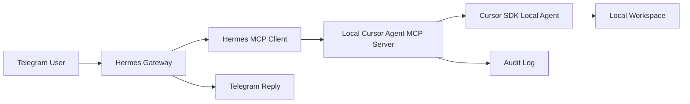

# Hermes + Telegram + Cursor MCP 独立集成说明

**日期**：2026-05-08  
**归属**：独立 Agent 基础设施，不属于 `news` 项目的 PRD/SDD/TDD 业务范围  
**状态**：Hermes Gateway 常驻已配置；Telegram -> Hermes -> Cursor MCP -> Cursor SDK Local Agent 基础链路已验证

---

## 更新日志

| 日期 | 版本 | 摘要 |
| --- | --- | --- |
| 2026-05-09 | v0.3 | 修复 Hermes -> Gemini 慢响应根因：自定义 `httpx` transport 绕过代理、Gemini OpenAI-compatible 认证方式错误、`SOUL.md` BOM 被误判阻断；补充耗时拆解、验证结果和回滚方案。 |
| 2026-05-08 | v0.2 | 新增 `H:\agent\hermes` 独立任务队列系统：本地 Web 看板、JSONL 队列、HTTP 入队接口、`task-queue` Hermes MCP 工具与运行说明。 |
| 2026-05-08 | v0.1 | 记录 Hermes Gateway 常驻、Telegram -> Hermes -> Cursor MCP -> Cursor SDK Local Agent 基础链路与安全边界。 |

---

## 1. 定位与边界

Hermes 与 Telegram 是独立智能体入口，不属于 `news` 项目的前端、Supabase、Edge Functions 或报告流水线。它可以作为未来自动化系统的远程入口，例如与 n8n、LangGraph 或其他 Agent 编排系统集成。

当前边界：

- Telegram 不能直接把消息注入当前 Cursor IDE 聊天窗口。
- Hermes Gateway 是 Telegram 消息入口，负责收发消息与会话。
- Cursor MCP 工具是 Hermes 可调用的工具层。
- Cursor SDK Local Agent 是实际执行本地项目分析/改码任务的 Agent。
- `cursor.cmd` 仅用于打开 Cursor IDE，不作为稳定 Agent API。

---

## 2. 当前架构



---

## 3. 已配置内容

### 3.1 Hermes Gateway Windows 常驻

启动脚本：

```text
C:\Users\lndlw\AppData\Local\hermes\scripts\Start-HermesGateway.ps1
```

Windows 任务计划程序：

```text
HermesGateway
```

常用开关：

```powershell
Start-ScheduledTask -TaskName HermesGateway
Stop-ScheduledTask -TaskName HermesGateway
Disable-ScheduledTask -TaskName HermesGateway
Enable-ScheduledTask -TaskName HermesGateway
Unregister-ScheduledTask -TaskName HermesGateway -Confirm:$false
```

说明：

- Windows 下 `hermes gateway status` 可能误报，应结合任务计划状态、进程、`agent.log` 判断。
- 启动脚本会清理 stale `gateway.pid`、`gateway_state.json` 和 Telegram lock，避免重复轮询冲突。

### 3.2 Cursor Agent MCP Server

当前实现目录：

```text
H:\AIcode\Trae\news\tools\cursor-agent-mcp
```

注意：该实现目录目前暂存于 `news` 工作区内，但它的业务归属是独立 Agent 基础设施。后续可迁移到统一 Agent 工具仓库。

Hermes MCP Server 名称：

```text
cursor-agent
```

已暴露工具：

| 工具 | 说明 |
| --- | --- |
| `cursor_agent_prompt` | 调用 Cursor SDK Local Agent 执行任务 |
| `cursor_agent_status` | 查询最近一次 Cursor Agent 状态 |
| `cursor_agent_resume` | 预留续写接口，首版暂不启用真正 durable resume |

---

## 4. 环境变量

必需：

```text
CURSOR_API_KEY
CURSOR_BRIDGE_ALLOWED_USERS
```

当前白名单用户：

```text
<telegram_user_id>
```

可选：

```text
CURSOR_BRIDGE_WORKSPACE
CURSOR_BRIDGE_MODEL
CURSOR_BRIDGE_AUDIT_DIR
```

默认模型：

```text
composer-2
```

原因：Cursor SDK local runtime 不接受 `auto`，需使用可用模型 ID。

---

## 5. 安全策略

当前策略：

- 只允许白名单 Telegram 用户调用。
- `readonly` 模式只允许分析，不允许写文件。
- `write` 模式必须传入确认参数。
- 默认拒绝：
  - `git push`
  - 部署动作
  - Supabase/Vercel 配置变更
  - 数据库写入
  - 文件删除
  - 破坏性 Git 命令

审计日志位置：

```text
C:\Users\lndlw\AppData\Local\hermes\logs\cursor-agent-mcp
```

审计内容包括时间、工具名、用户、任务摘要、风险级别、状态和错误摘要。不得记录完整密钥。

---

## 6. 已验证结果

已验证：

- `hermes mcp test cursor-agent` 可连接并发现工具。
- `cursor_agent_status` 可返回状态。
- 危险请求如 `git push/部署` 会被策略拦截。
- 未确认的 `write` 请求会被策略拦截。
- 只读 Cursor SDK Local Agent 调用成功，可访问本地工作区并返回中文摘要。
- Hermes Gateway 已通过任务计划程序常驻。

Telegram 端已验证：

- 可通过 Hermes 调用 `cursor_agent_prompt` 获取本地项目目录结构摘要。

---

## 7. 当前限制

- Telegram 仍是在和 Hermes Agent 对话，不是在和当前 Cursor IDE 聊天窗口对话。
- Hermes 自身可能选择先用自己的 terminal/file 工具，而不是每次都调用 `cursor-agent` MCP；提示词需要明确要求“调用 cursor_agent_prompt”。
- `hermes chat -q` 在某些非交互 Windows Shell 中可能因 `prompt_toolkit` 控制台缓冲区问题失败；不影响 Gateway 和 MCP 工具本身。
- OpenRouter 免费模型可能慢或返回 provider error，这属于 Hermes 主模型链路问题，不代表 Cursor MCP 工具不可用。

---

## 8. 推荐使用方式

Telegram 中明确这样写：

```text
请调用 cursor_agent_prompt，只读模式，检查当前项目结构，不要修改文件，用中文返回摘要。
```

如果要让 Cursor Agent 修改文件，应显式说明范围，并接受后续确认机制：

```text
请调用 cursor_agent_prompt，write 模式，confirmed=true，仅修改指定文档，不要提交，不要 push，不要部署。
```

---

## 9. 后续方向

该基础设施后续更适合服务于独立自动化系统，而不是嵌入 `news` 项目业务文档。

可能方向：

- Hermes + n8n：适合流程编排、定时任务、通知、Webhook。
- Hermes + LangGraph：适合多 Agent 状态机、复杂任务分派、可恢复工作流。
- Cursor MCP：适合作为“本地代码工作区执行器”，仅在需要读写代码时调用。

建议原则：

- 业务系统与 Agent 基础设施文档分离。
- Telegram 只作为远程入口，不作为生产业务流程的一部分。
- 高风险动作保留人工确认。

---

## 10. Telegram 统一任务队列（v0.2）

### 10.1 目标

将 Telegram/Hermes 消息写入本地统一任务队列，并通过本地 Web 看板观察消息是否已收到、当前状态和处理记录。

该能力仍不等于“Telegram 直接注入当前 Cursor 聊天窗口”。它提供的是可观察的中间层：Telegram 消息进入队列后，用户可以在 Cursor 中要求 Agent 读取 `tasks.jsonl`，或未来再接入自动消费者。

### 10.2 文件位置

```text
H:\agent\hermes
```

核心文件：

```text
H:\agent\hermes\src\server.ts
H:\agent\hermes\src\queue.ts
H:\agent\hermes\src\hermes-adapter.ts
H:\agent\hermes\src\mcp-server.ts
H:\agent\hermes\data\tasks.jsonl
H:\agent\hermes\README.md
```

### 10.3 本地看板

```text
http://127.0.0.1:8787
```

看板能力：

- 显示最新入队消息。
- 显示来源、用户、会话、正文、状态、更新时间。
- 支持复制正文。
- 支持标记 `processing`、`done`、`failed`。

### 10.4 HTTP API

健康检查：

```text
GET /api/health
```

任务列表：

```text
GET /api/tasks
```

入队：

```text
POST /api/tasks
```

示例请求体：

```json
{
  "source": "telegram",
  "chatId": "<telegram_chat_id>",
  "user": "telegram-user",
  "text": "需要处理的消息"
}
```

更新状态：

```text
POST /api/tasks/:id/status
```

### 10.5 Hermes MCP 工具

已注册 Hermes MCP Server：

```text
task-queue
```

工具：

| 工具 | 说明 |
| --- | --- |
| `queue_create_task` | 将 Telegram/Hermes 消息写入本地任务队列 |
| `queue_list_tasks` | 查询最近任务 |
| `queue_update_task_status` | 更新任务状态 |

Telegram 推荐提示：

```text
请调用 queue_create_task，把这条消息写入本地任务队列。text=这里填写我要处理的内容，source=telegram。
```

### 10.6 验证记录

已验证：

- `npm run typecheck` 通过。
- `GET http://127.0.0.1:8787/api/health` 返回正常。
- `POST /api/tasks` 可写入任务。
- `GET /api/tasks` 可读取任务。
- `POST /api/tasks/:id/status` 可更新状态。
- `hermes mcp test task-queue` 可发现 3 个工具。
- Hermes Gateway 重启后 `task-queue` MCP 工具已启用。

### 10.7 安全边界

首版只做“收消息 + 看板 + 人工处理”，不自动执行：

- 不改代码。
- 不删除文件。
- 不 `git push`。
- 不部署。
- 不写数据库。
- 不调用生产环境 API。

后续如要自动消费队列并触发 Cursor SDK Agent，需要新增白名单、确认机制、审计、回滚和并发控制。

---

## 11. Hermes Gateway 慢响应排障与修复（v0.3）

### 11.1 问题现象

Telegram 向 Hermes 发送简单消息后，曾出现以下问题：

- 长时间卡在 `pondering...`，Telegram 提示 `No response from provider for 180s`。
- 即使只保留 `task-queue` MCP，仍然等待 Gemini provider 超时。
- 修复代理后又出现 `HTTP 400 API_KEY_INVALID`。
- `SOUL.md` 被 `invisible unicode U+FEFF` 判定为潜在 prompt injection，导致中文 persona 未生效。
- 简单问候在完整 system prompt 下仍可能耗时 8-16 秒。

### 11.2 根因结论

本次不是单纯“模型慢”或“工具太多”导致。根因分层如下：

1. **主根因：Hermes OpenAI client 自定义 transport 绕过系统代理。**  
   Hermes 在 `run_agent.py` 中为 OpenAI client 注入 `httpx.Client(transport=httpx.HTTPTransport(socket_options=...))`。该自定义 transport 会绕过 `HTTP_PROXY/HTTPS_PROXY` 环境代理，而当前机器访问 Gemini 依赖 `127.0.0.1:58591` 代理，因此 provider 连接长期无首包。

2. **次根因：Gemini OpenAI-compatible endpoint 认证方式不匹配。**  
   当前 Google `generativelanguage.googleapis.com/v1beta/openai/chat/completions` 接受 `Authorization: Bearer <GOOGLE_API_KEY>`。Hermes 原逻辑把 key 改写到 `x-goog-api-key` 并使用 `api_key=not-used`，该路径会返回 `API_KEY_INVALID`。

3. **次根因：辅助模型自动探测有固定开销。**  
   `auxiliary.*.provider=auto` 会触发 `Vision auto-detect` 和 `Auxiliary auto-detect`，简单请求中各约数秒。改为显式 `gemini-2.0-flash` 后，该部分日志消失。

4. **次根因：`SOUL.md` BOM 处理不当。**  
   `SOUL.md` 是 UTF-8 with BOM，原读取方式 `utf-8` 保留 `\ufeff`，被 Hermes prompt 安全扫描判定为 invisible unicode 并阻断。改为 `utf-8-sig` 后可正常读取中文 persona。

5. **剩余性能瓶颈：system prompt 与工具 schema 仍较大。**  
   当前 `last_prompt_tokens` 约 7k，主要来自 Hermes 默认技能说明、工具使用约束、Telegram 平台说明与 MCP 工具 schema。按当前决策，暂不删减 system prompt。

### 11.3 已实施修复

修改位置：

```text
C:\Users\lndlw\AppData\Local\hermes\hermes-agent\run_agent.py
C:\Users\lndlw\AppData\Local\hermes\hermes-agent\agent\auxiliary_client.py
C:\Users\lndlw\AppData\Local\hermes\hermes-agent\agent\prompt_builder.py
C:\Users\lndlw\AppData\Local\hermes\config.yaml
C:\Users\lndlw\AppData\Local\hermes\SOUL.md
```

修复内容：

- 在自定义 `httpx.Client` 保留 TCP keepalive 的同时，显式读取 `HTTPS_PROXY` / `HTTP_PROXY` / `ALL_PROXY`，并传给 `proxy=`，避免绕过本地代理。
- Gemini OpenAI-compatible 路径保留 OpenAI SDK 默认 Bearer 认证，不再改写为 `x-goog-api-key`。
- `auxiliary.vision`、`auxiliary.compression`、`auxiliary.title_generation` 等从 `auto` 改为显式 `gemini-2.0-flash`。
- `load_soul_md()` 改为 `utf-8-sig` 读取，自动剥离 BOM。
- `SOUL.md` 写入中文默认 persona：默认中文、简洁、直接。
- Telegram DM `<telegram_chat_id>` 增加 channel prompt：默认中文回复。

### 11.4 验证结果

已验证：

- 直接 Gemini 普通请求、tools 请求、streaming 请求均可在数秒返回。
- 复刻 Hermes 自定义 transport 且不传代理时会卡住；显式传代理后可正常返回。
- 修复后 Telegram 不再出现 `No response from provider for 180s`。
- 修复后不再出现 `API_KEY_INVALID`。
- 修复后 `/new` 后中文问候已可中文回复。
- `py_compile` 通过。
- `hermes config check` 通过。
- Gateway 重启后可重新连接 Telegram。

典型日志耗时：

```text
20:09:50.466 inbound message: 你好
20:09:51.345 Loaded environment variables
20:09:53.923 task-queue MCP registered
20:10:06.689 response ready, time=16.2s
```

最新业务类消息验证：

```text
13:15:03.435 inbound message
13:15:15.841 response ready, time=12.4s
```

### 11.5 System Prompt 审计文件

当前完整 system prompt 已按 UTF-8 导出：

```text
H:\agent\hermes\debug\hermes_system_prompt_20260508_200924_1a8294fb_utf8.md
```

注意：

- `hermes_system_prompt_20260508_200924_1a8294fb.md` 是早期 PowerShell 导出，存在二次编码乱码，应忽略。
- 当前暂不删减 system prompt，后续如需继续提速，再基于该文件逐段评估。

### 11.6 剩余优化空间

当前不建议继续改动的部分：

- 不删减 system prompt。
- 不移除 `task-queue` MCP。
- 不改 Hermes 与 Cursor 的协作架构。

后续可选优化：

- 缓存或常驻 `task-queue` MCP stdio 连接，减少每轮约 2-3 秒注册开销。
- 按 Telegram 场景裁剪 Hermes 默认技能说明与 `<available_skills>`，预计可减少 prompt tokens。
- 仅在需要工具时启用工具使用强约束，普通对话使用轻量 prompt。
- 将“简单问候/状态查询”做本地快速回复，但这会改变 Hermes 的标准 Agent 行为，需要单独评审。

### 11.7 回滚方案

如需回滚本次 Hermes 修复：

1. 恢复 `run_agent.py` 中自定义 `httpx.Client` 的原始 transport 构造逻辑。
2. 恢复 Gemini `x-goog-api-key` 改写逻辑。
3. 将 `config.yaml` 中 `auxiliary.*.provider` 改回 `auto`。
4. 将 `prompt_builder.py` 的 `SOUL.md` 读取编码改回 `utf-8`。
5. 移除 Telegram `channel_prompts.<telegram_chat_id>`。
6. 重启 Hermes Gateway。

不建议回滚第 1、2、4 项；这些是明确根因修复，回滚后会恢复超时、认证错误或中文 persona 阻断。
